# Gestion de Projet : FoodTruck

## MCD
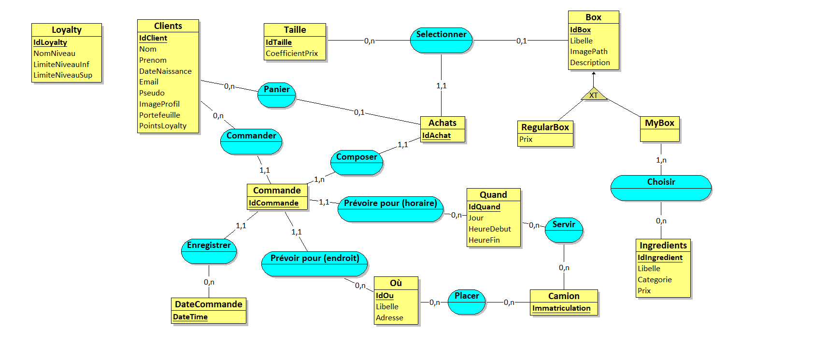

## But de l'application
**_Permettre à un utilisateur de réserver un type de box à aller chercher dans un food truck_**

## Fonctionnalités de l'application
* Commander des box
* Creation de box personalisée
* Localisation du food truck
* Différents systèmes de paiement
* Creation de profil avec un système de fidélité

## Design de l'application

### Version Mobile
#### Acceuil
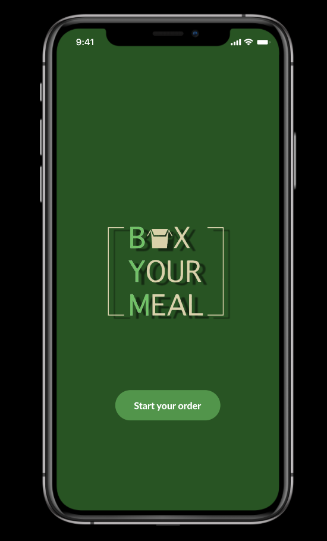
#### Catalogue
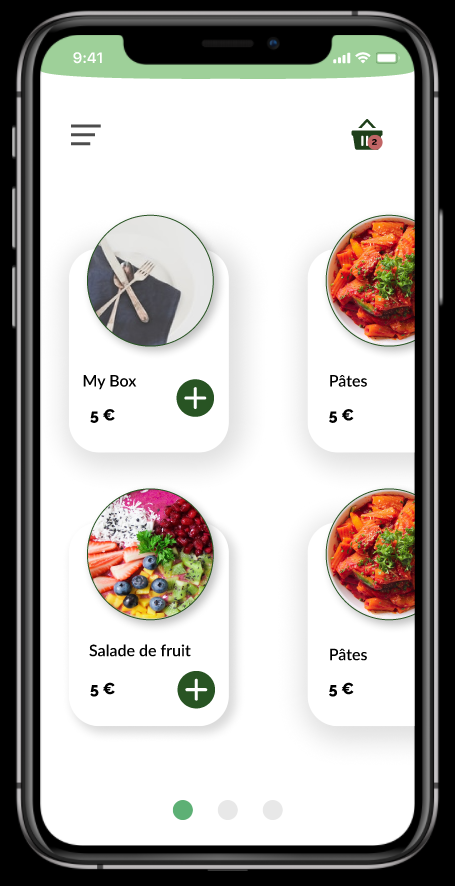
#### Menu
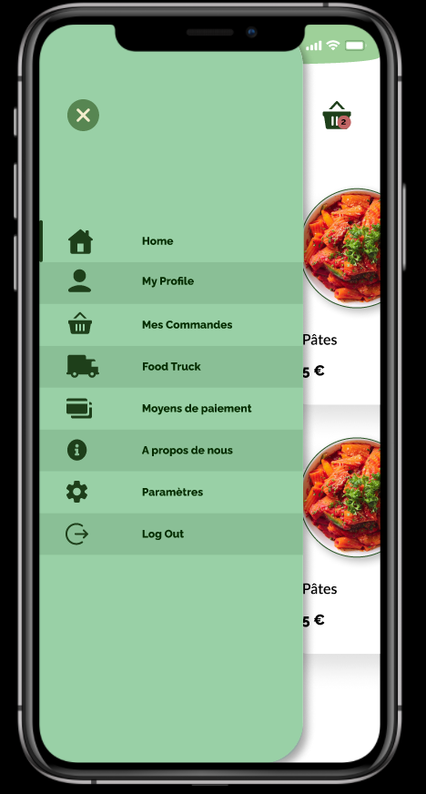
#### Box originale
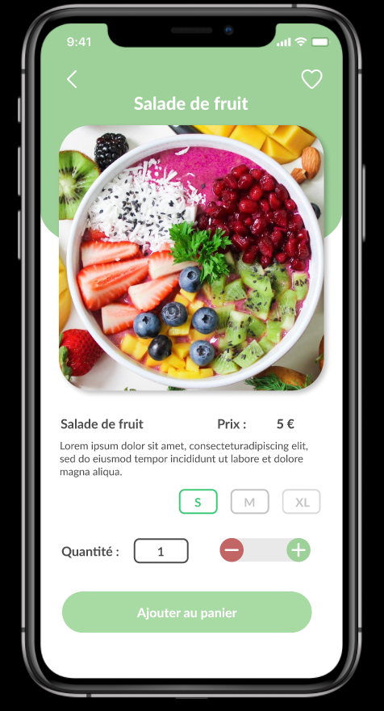
#### Box personalisée
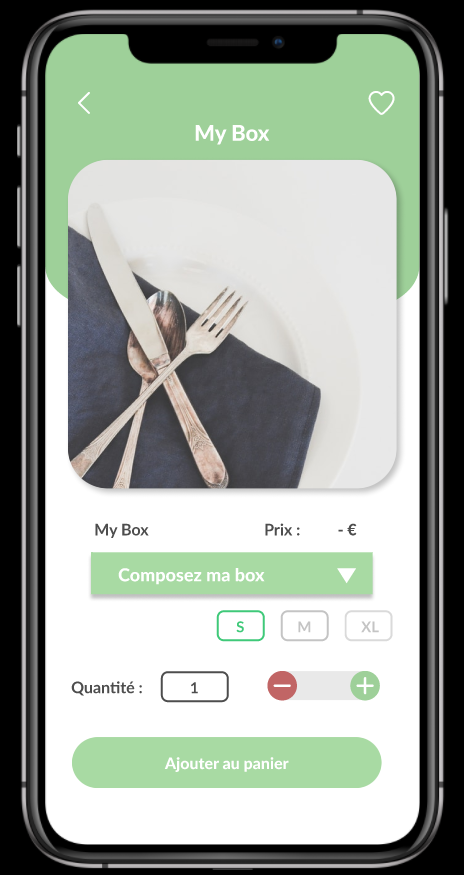
#### Panier
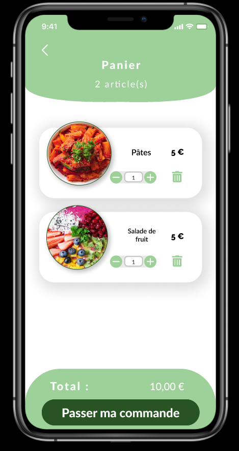
#### Localisation du food truck
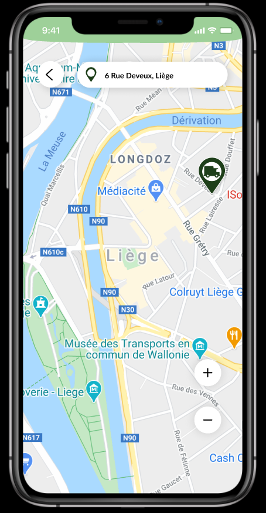
#### Profil
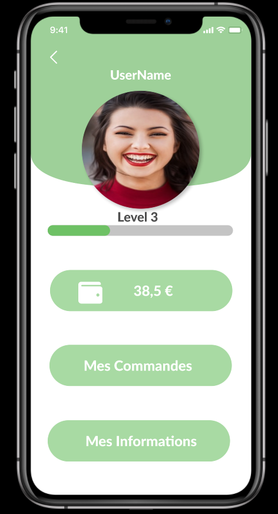
#### Info sur l'application
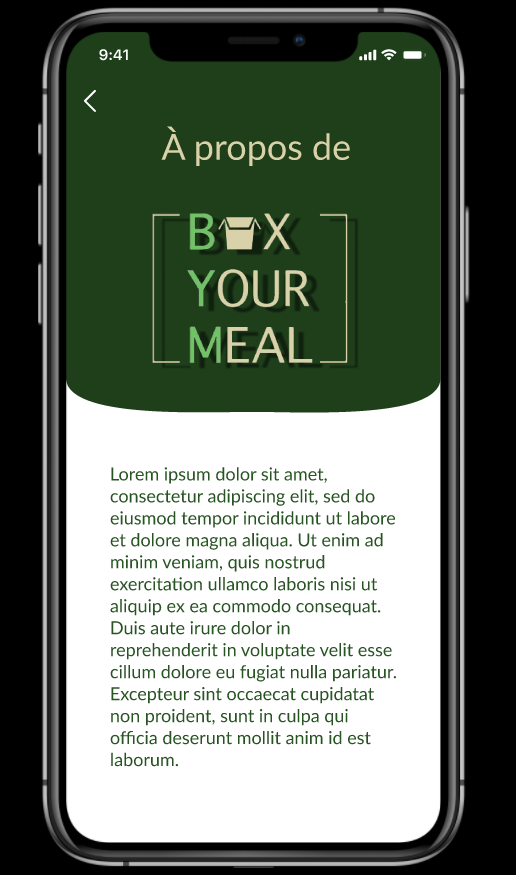

### Version Web
#### Acceuil
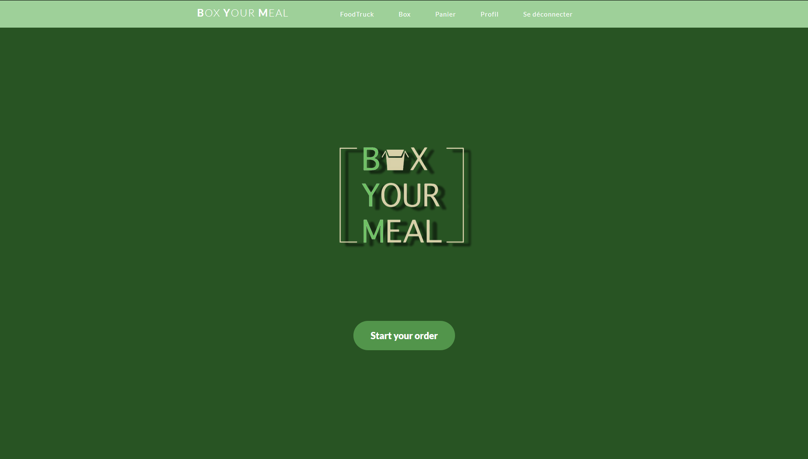
#### Catalogue
 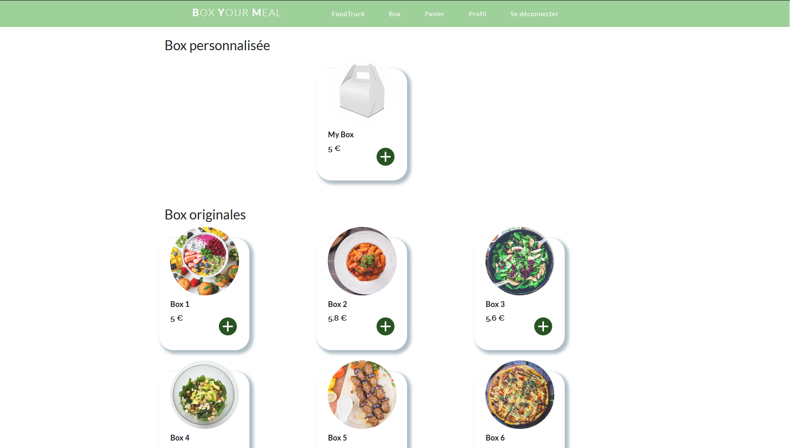
#### Box originale
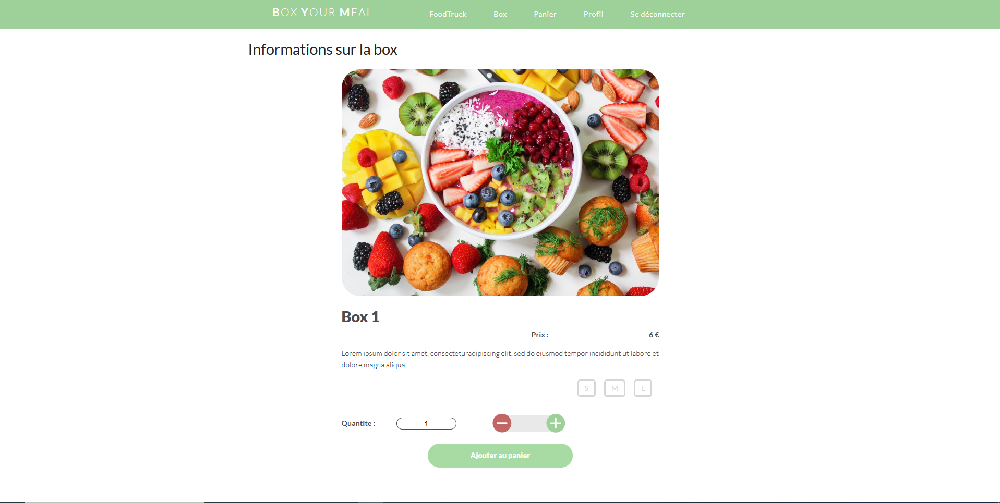
#### Box personalisée

#### Panier
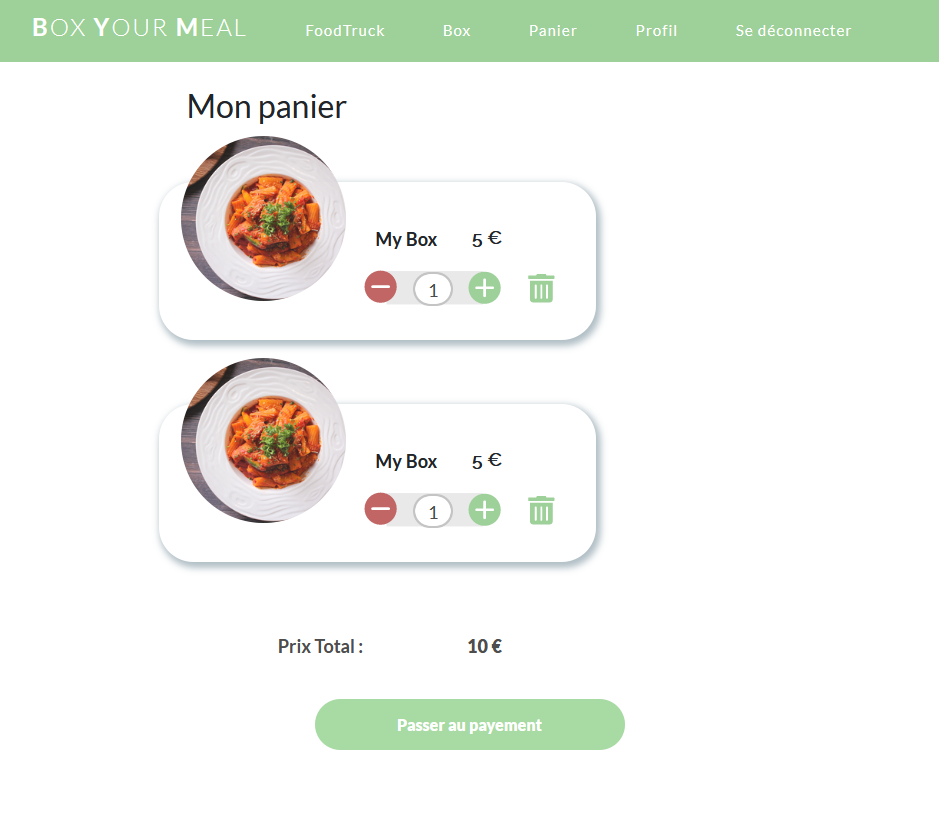
#### Profil

## Technologies utilisées
* Figma
* HTML/CSS
* JS

### Crée par
##### Ludivine Defraine & Benedict Khamana